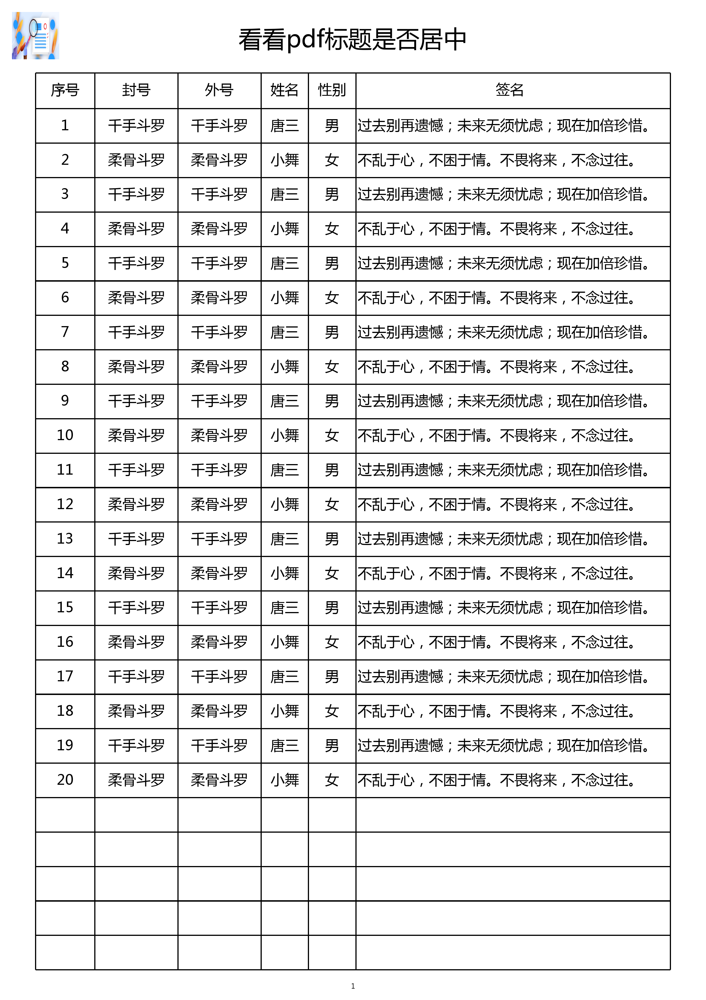

# pdf table generator

1. separate pdf output and data generation via interface.
2. position to display values will be calculated.
3. the result can be output to file or HTTP.

## interface

```go
type PDFGenerator interface {
    // 在输出整个pdf之前调用，在这里可以做一些输出准备工作
    Init()
    // 输出结束时调用
    Cleanup()

    GetPageSize() (pageSize *Rect)  // 页面尺寸，比如A4

    // 获取线条属性，比如 width=0.5, lineType="normal"
    GetLineAttr() (drawLine bool, width float64, lineType string)

    // 获取字体名称及字体文件
    GetFonts() (<-chan *Font)

    // 获取图片及属性
    GetImages() (<-chan *ImageAttr) // Image-Path => {Left-upper Point, width, height}

    // 获取输出目标
    GetWriter() io.Writer

    // 获取pdf的标题、底部y坐标、字体名称、字体大小。(标题会在计算后居中显示)
    GetTitle() (title string, y float64, fontFamily string, fontSize float64)

    // 获取pdf的标题栏: 第一行的(x,y)坐标、高度、字体名称、字体大小、标题描述
    GetColumnTitles() (x, y float64, height float64, fontFamily string, fontSize float64, titles []*Title)

    // 获取所有的输出行: 第一行的y坐标、高度、字体名称、字体大小、输出行(标题Name => 值)的channel
    GetRows() (firstY float64, height float64, fontFamily string, fontSize float64, rows <-chan map[string]string)
```

## usage

```go
package main

import (
    "github.com/rosbit/pdf-table-generator"
    "os"
    "io"
    "log"
)

func main() {
    pg := &pdfTest{}
    pdfgen.GeneratePDFTable(pg);
}

// ---- PDFTableGenerator implementation ----
type pdfTest struct {
    pdfgen.A4PDFTableGenerator
    o *os.File
}

func (t *pdfTest) Init() {
    o, e := os.OpenFile("./a.pdf", os.O_WRONLY|os.O_CREATE|os.O_TRUNC, 0755)
    if e != nil {
        log.Printf("%v\n", e)
        return
    }
    t.o = o
}

func (t *pdfTest) Cleanup() {
    if t.o != nil {
        t.o.Close()
    }
}

func (t *pdfTest) GetFonts() (<-chan *pdfgen.Font) {
    c := make(chan *pdfgen.Font)
    go func() {
        c <- &pdfgen.Font{
            Family: "msyh",
            FontPath: "./msyh.ttf", // make sure the file exists
        }
        close(c)
    }()

    return c
}

func (t *pdfTest) GetImages() (<-chan *pdfgen.ImageAttr) {
    c := make(chan *pdfgen.ImageAttr)
    go func(){
        c <- &pdfgen.ImageAttr{
            Point: pdfgen.Point{
                X: 10,
                Y: 10,
            },
            Rect: pdfgen.Rect{
                W: 40,
                H: 40,
            },
            ImagePath: "./logo.png", // make sure the file exists
        }
        close(c)
    }()

    return c
}

func (t *pdfTest) GetWriter() io.Writer {
    return t.o
}

func (t *pdfTest) GetTitle() (title string, y float64, fontFamily string, fontSize float64) {
    title = "看看pdf标题是否居中"
    y = 40
    fontFamily = "msyh"
    fontSize = 20.0
    return
}

func (t *pdfTest) GetColumnTitles() (x, y float64, height float64, fontFamily string, fontSize float64, titles []*pdfgen.Title) {
    x, y = 30.0, 70.0
    height = 30.0
    fontFamily = "msyh"
    fontSize = 12.0
    titles = []*pdfgen.Title{
        &pdfgen.Title{
            Name: "序号",
            Width: 50,
        },
        &pdfgen.Title{
            Name: "封号",
            Width: 70,
        },
        &pdfgen.Title{
            Name: "外号",
            Width: 70,
        },
        &pdfgen.Title{
            Name: "姓名",
            Width: 70,
        },
        &pdfgen.Title{
            Name: "性别",
            Width: 70,
        },
        &pdfgen.Title{
            Name: "签名",
            Width: 260,
            ColumnValueAlignLeft: true,
        },
    }

    return
}

func (t *pdfTest) GetRows() (firstY float64, height float64, fontFamily string, fontSize float64, rows <-chan map[string]string) {
    firstY = 100
    height = 29.0
    fontFamily = "msyh"
    fontSize = 12.0

    c := make(chan map[string]string)
    go func() {
        c <- map[string]string{
            "序号": "1",
            "封号": "千手斗罗",
            "外号": "千手斗罗",
            "姓名": "唐三",
            "性别": "男",
            "签名": "过去的，...；未来的，...；现在的，...。",
        }
        c <- map[string]string{
            "序号": "2",
            "封号": "柔骨斗罗",
            "外号": "柔骨斗罗",
            "姓名": "小舞",
            "性别": "女",
            "签名": "不乱...，不困...。不畏...，不念...。",
        }
        close(c)
    }()

    rows = c
    return
}
```

## result


